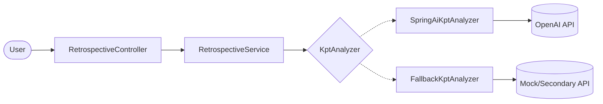

# AI Retrospective Assistant PoC

취업 준비 과정의 좌절감을 **KPT(Keep / Problem / Try)** 프레임워크로 분석하여 객관적인 자산으로 바꿔주는 AI 회고 도우미입니다.

---

## 🚀 Key Technical Highlights

본 PoC는 단순히 AI API를 호출하는 것을 넘어, **실제 운영 환경에서 고려해야 할 기술적 도전 과제**들을 다음과 같이 해결했습니다.

| 키워드 | 해결한 문제 | 적용 기술 |
| :--- | :--- | :--- |
| **Performance** | LLM 호출(I/O Bound) 시의 스레드 고갈 방지 | **Java 21 Virtual Threads** |
| **Resiliency** | 외부 API 장애 시 서비스 가용성 확보 | **Resilience4j** (Retry/CircuitBreaker) + **Fallback 모델** |
| **Architecture** | AI 엔진 변경에 유연한 설계 (의존성 역전) | **Hexagonal Architecture** (Ports & Adapters) |
| **Clean Code** | 비결정적 AI 응답의 안정적 핸들링 | **Sealed Interface** + **Pattern Matching** |
| **DX** | 개발자 및 협업 도구 지원 | **Swagger**, **Postman**, **Actuator**, **MDC Filter** |

---

## 🏗️ Architecture & Flow

도메인 모델을 중심에 두고 외부 의존성을 인터페이스(Port) 뒤로 격리하는 **Hexagonal Architecture**를 따릅니다.



- **의존성 흐름**: `interfaces` → `application` → `domain` ← `infrastructure`
- **결과 핸들링**: `Success(KptAnalysis)` 또는 `Failure(ErrorCode)`를 Sealed Interface로 반환하여 명확한 비즈니스 로직 분기 수행

---

## 🛠️ Tech Stack

- **Core**: Java 21, Spring Boot 3.4.5, Spring AI 1.0.0
- **Stability**: Resilience4j 2.2 (Retry, Circuit Breaker)
- **API/Docs**: Springdoc OpenAPI 2.8, Jakarta Validation, ProblemDetail (RFC 7807)
- **Monitoring**: Spring Boot Actuator, SLF4J (MDC Correlation ID)

---

## 🏃 Quick Start

### Prerequisites
- JDK 21+
- OpenAI API Key (`OPENAI_API_KEY` 환경변수)

### Run
```bash
cd poc/juneseok
OPENAI_API_KEY=sk-... ./gradlew bootRun
```

### Test
- **Swagger UI**: [http://localhost:8082/swagger-ui/index.html](http://localhost:8082/swagger-ui/index.html)
- **Postman**: [`postman/Retrospective-AI.postman_collection.json`](postman/Retrospective-AI.postman_collection.json) 임포트 (7개 테스트 시나리오 포함)

---

## 📡 API Spec

### POST `/api/v1/retrospective/analyze`

**Request Body**
```json
{
  "context": "오늘 코딩 테스트에서 시간이 부족해 마지막 문제를 놓쳤습니다. 자료구조 복습이 필요할 것 같아요."
}
```

**Success Response (200)**
```json
{
  "keep": ["끝까지 포기하지 않고 푼 점"],
  "problem": ["시간 분배 전략 부재", "특정 자료구조 익숙도 낮음"],
  "try": ["내일 30분 자료구조 복습", "타이머 25분 룰 적용"],
  "cheer_message": "오늘도 시도한 것만으로 충분히 잘하셨습니다!"
}
```

**Error Codes**
- `UPSTREAM_TIMEOUT` (504): AI 응답 지연 (자동 재시도)
- `UPSTREAM_UNAVAILABLE` (502): AI 서비스 장애 (서킷 브레이커 작동)
- `INVALID_RESPONSE` (422): AI 응답 파싱 실패

---

## ⚙️ Configuration

핵심 설정은 [`application.yml`](src/main/resources/application.yml)에서 관리됩니다.
- `spring.threads.virtual.enabled: true` (가상 스레드 활성)
- `resilience4j.circuitbreaker.failure-rate-threshold: 60` (서킷 임계치)
- `retrospective.ai.timeout: 20s` (AI 호출 타임아웃)
